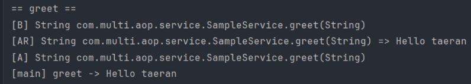
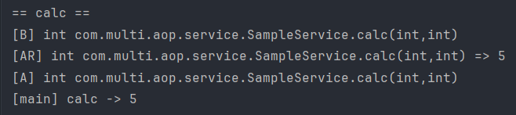
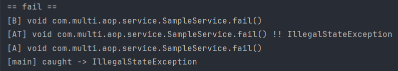

## 1. greet, calc, fail 호출 시 로그 순서 캡처/설명

### - greet("taeran") / calc(2, 3) 정상 리턴

- @Before: 대상 메서드 실행 직전

- 대상 메서드(svc.greet / svc.calc) 실행: "Hello taeran", "5" 반환

- @AfterReturning: 정상 리턴 직후, 리턴값 접근 가능

- @After: 정상/예외 관계없이 항상 마지막에 실행

- main println: 모든 어드바이스가 완전히 끝난 뒤 호출자 쪽에서 실행

### - fail() 예외 발생 

- @Before: 실행 전

- 대상 메서드에서 예외 발생

- @AfterThrowing: 예외 던져진 직후, 예외(ex) 접근 가능

- @After: 정상/예외 모두 항상 실행

- 예외가 호출자(main)로 전파되고, try-catch에서 catch 후 프린트

## 2. @AfterReturning vs main println 순서 차이
- @AfterReturning : 대상 메서드가 정상적으로 실행되어 값을 반환한 뒤에 실행되는 Advice로 메서드 실행 결과에 접근할 수 있고 반환값을 읽을 수 있드ㅏ

- main println : 모든 Advice가 끝난 뒤 실행한다.

## 3. Advice
- @Before : 핵심 로직(Join Point) 실행 직전에 실행
- @AfterReturning : 메서드가 정상 종료 후 실행
- @AfterThrowing : 메서드에서 예외 발생 시 실행
- @After : 메서드 실행의 성공/실패 상관없이 종료 후 실행
- @Around : 메서드 실행 전후 전체를 감싸 실핼